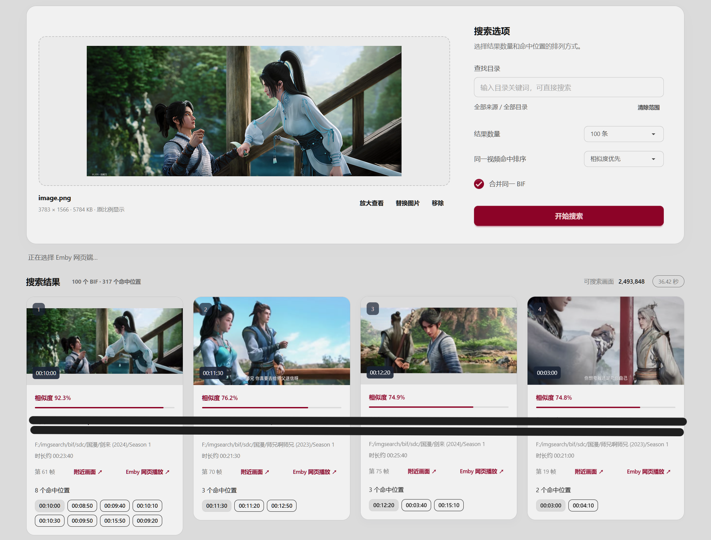

# FrameSeek

放入一张截图，找到相似的视频画面、所在文件和对应时间，再点击结果，通过 Emby 从命中位置开始播放。

项目使用 DINOv3 ViT-L/16 提取图片特征，Qdrant 负责检索，SQLite 保存文件信息和搜索历史。可以在本地用显卡建立索引，再交给 NAS 提供搜索服务。


## 可以做什么

- 上传、拖拽或粘贴截图，按目录缩小搜索范围。
- 读取 Emby 生成的 BIF 缩略图，利用已有的视频画面建立索引。
- 同时检索 JPG、PNG、WebP 等普通图片，可选择全部、仅 BIF 视频画面或仅图片。
- 将同一视频的命中放在一起，按相似度或时间排序，查看附近画面。
- 保存搜索截图和结果，随时查看历史记录。
- 自动处理新增或修改的 BIF 和图片，中断后继续处理。
- 联动 Emby，从截图对应的时间点播放视频，支持独立播放窗口和 Emby 网页端。

Emby 的路径和文件名匹配都没有找到视频时，会查找 BIF 同目录的同名 MP4，在新窗口直接播放并跳到命中时间。例如 `片名-320-10.bif` 对应 `片名.mp4`。直接播放不经过 Emby、不转码，浏览器需要支持视频的编码格式。

普通图片支持 JPG/JPEG、PNG、WebP、BMP、GIF 和 TIFF。与 BIF 共用监控目录，下一次扫描会自动加入处理；搜索时可按类型和目录组合筛选。动图和多页 TIFF 只索引第一张画面，图片结果可查看预览。已有 BIF 索引无需重新编码。

## 搜索效果

<table>
  <tr>
    <td width="50%"></td>
    <td width="50%"></td>
  </tr>
</table>

## 与 Emby 联动

支持直接读取 Emby 生成的 BIF 视频缩略图，从其中的画面建立搜索索引，无需重新解码原视频，也无需将缩略图展开成大量 JPEG 文件。在“设置”中填写存放 BIF 的目录，系统会查找该目录及子目录中的 `.bif` 文件。

在“设置 → Emby 播放”中填写 Emby 服务地址和 API Key，点击“读取用户与网页设备”，选择播放用户和方式，再开启“点击搜索结果播放”。API 和网页共用一个地址，应用和浏览器都需能访问。API Key 在 Emby 管理后台创建。


## 准备模型

先手动下载 [DINOv3 ViT-L/16 LVD-1689M](https://huggingface.co/facebook/dinov3-vitl16-pretrain-lvd1689m)，放到 `models/dinov3-vitl16`。目录中应有 `config.json` 和完整的 `.safetensors` 权重；分片模型还需要 `.safetensors.index.json`。模型页面需要申请访问。

国内镜像下载 [DINOv3 ViT-L/16 LVD-1689M](https://modelscope.cn/models/facebook/dinov3-vitl16-pretrain-lvd1689m/files)

## 在 NAS 上运行

使用 [`compose.ghcr.yml`](compose.ghcr.yml) 拉取 GitHub 构建好的 CPU 镜像，适用于 Intel/AMD NAS。

把 Compose 文件放到项目目录，修改其中的媒体目录。镜像地址 `ghcr.io/ting1e/frameseek:latest`。路径、端口、内存等启动配置直接写在 Compose；监控目录、处理线程和搜索选项在网站中设置。

Compose 修改媒体挂载路径：
```yaml
volumes:
  - /mnt/videos:/mnt/videos:ro
  - /mnt/archive:/mnt/archive:ro
```
下载好模型、改好媒体目录后，在项目目录直接启动：

```bash
docker compose -f compose.ghcr.yml up -d
```

首次启动会自动创建数据目录、生成模型清单和登录信息，再启动网站及 Qdrant。登录信息查看：

```bash
docker compose -f compose.ghcr.yml exec app cat /data/credentials.txt
```

默认用户名为 `admin`，可在 Compose 中修改；重启沿用原来的登录信息。数据和首次启动配置保存在 `data`，模型目录保持只读。


应用端口为 `127.0.0.1:18443`，接入 HTTPS 反向代理后访问。镜
登录网站后，在“设置”中填写需要监控的完整目录，每行一个，例如 `/mnt/videos` 或 `/mnt/videos/国产剧`，修改后自动保存到 SQLite，下一轮扫描生效。取消监控会保留已有索引；添加尚未挂载的宿主机目录时，先修改 Compose 挂载。点击后台任务中的手动扫描，或开启自动更新。

### 
### 更新镜像

在网页暂停后台任务，然后执行：

```bash
docker compose -f compose.ghcr.yml pull
docker compose -f compose.ghcr.yml up -d
```

更新后恢复后台任务。需要固定版本时，将镜像的 `latest` 改为版本号或 `sha-<完整提交SHA>`。模型、索引和网站配置都保存在挂载目录中。


## 本地开发和建索引

使用 Python 3.10+，显卡推理需要安装对应的 PyTorch CUDA 版本。

```bash
python -m venv .venv
# 激活虚拟环境后执行
pip install -e '.[ml,test]'
frameseek init
frameseek prepare-model
frameseek serve
```

在网页“设置 → 图片特征提取”中选择 CPU、NVIDIA GPU 或 Intel 核显，以及 FP32 / FP16。修改自动保存，重启应用后生效；页面显示当前运行的设备和精度。已有设置缺少这些字段时沿用 `IMGS_DEVICE`（默认 CPU）和 `IMGS_PRECISION`（默认 FP32）。媒体目录和处理批次在网站配置。旧目录映射会保存到 SQLite，现有索引继续使用，无需重新编码。命令行也可以建索引：

默认 GHCR 镜像支持 CPU 和 Intel 核显。NVIDIA GPU 推理需安装 CUDA 版 PyTorch；在 Docker 中运行还需透传显卡。FP16 不一定更快，可按实际处理速度选择。

```bash
frameseek scan
frameseek index
frameseek index --verify-only
frameseek status
```

Intel 核显需要额外准备同一模型的 OpenVINO 文件（只转换一次），并允许容器访问核显：

```bash
frameseek prepare-openvino --output models/dinov3-vitl16-openvino
export IMGS_RENDER_GID=$(stat -c '%g' /dev/dri/renderD128)
docker compose -f compose.ghcr.yml -f compose.intel.yml up -d
```

转换目录须与 `models/dinov3-vitl16` 来自同一模型。`compose.intel.yml` 将转换后的文件只读挂载，并补充核显设备权限；镜像包含 OpenVINO 和 Intel 计算驱动。网页会禁用未检测到或尚未准备好的设备，不会自动回退 CPU。Intel FP16 自动使用激活缩放系数 8，避免 DINOv3 中间值越界；现有索引保持不变，但 FP16 可能影响相似度和排序。Intel 后端当前按单张运行；NVIDIA 使用现有 PyTorch/CUDA 后端。CPU / NVIDIA 的 FP16 使用自动混合精度，保留 LayerScale 和最终归一化的 FP32 计算。`IMGS_OPENVINO_MODEL` 可以指定其他转换目录。

从 NAS 复制 BIF 时，将 [`sync.example.json`](sync.example.json) 复制为 `sync.local.json`，填写 SSH 连接和远程目录，使用系统 SSH 密钥连接：

```bash
frameseek inventory
frameseek sync
```

`frameseek backup` 可以备份 SQLite 和 Qdrant 快照，搜索历史和网站配置也会一起保存。

开启自动更新后，程序实时监听监控目录中的 BIF 和图片变动，等待文件稳定后更新索引。普通文件只检查发生变动的路径，目录移动等操作会触发扫描补查；启动、手动扫描和定时补查也会扫描目录，补查默认每 24 小时一次，可在设置页调整。关闭自动更新后停止监听，暂停时暂存变动，恢复后继续处理。NAS 使用 Linux 原生文件事件监听，Windows 本地运行也支持；监听启动失败时继续定时扫描，后台任务页显示提示。

后台任务中，“手动扫描”只发现文件并建立任务，“手动编码”处理已有队列，“重新解析失败文件”再次尝试之前无法解析的文件。关闭自动更新时，这些操作可以单独执行。处理记录保存全部内容，可分页查看或手动清空；清空记录不影响索引、搜索历史和任务。BIF 同时支持标准 64 字节头部格式和 16 字节头部的紧凑格式。

所有 Compose 都直接使用 GHCR 镜像：`compose.yml` 默认 2 GiB，`compose.ghcr.yml` 默认 12 GiB。本地 HTTP 测试使用 `compose.yml` 加 `compose.local.yml`（Docker Compose 2.24.4+），首次启动自动生成登录信息。内存模式直接修改 Compose 中的 `mem_limit` 和 `IMGS_MODE`。

源码按用途放在 `frameseek/` 的子目录中：

| 目录 | 内容 |
| --- | --- |
| `core/` | 配置、认证、SQLite 和路径处理 |
| `media/` | BIF、图片解析与目录范围 |
| `engine/` | 特征提取、向量检索与后台索引 |
| `integrations/` | Emby、NAS 连接与文件同步 |
| `tools/` | 模型初始化、评测、备份与迁移 |
| `static/` | 网页和样式 |

`cli.py` 和 `web.py` 分别是命令行与网站入口。测试在 `tests/`，开发脚本在 `scripts/`。本地验证新镜像可运行 `docker build -t frameseek:ci .`；部署无需本地构建。

`theme.css` 是 daisyUI 样式构建入口。修改主题或前端使用的样式类后，用 Node.js 20+ 运行 `npm ci` 和 `npm run build:css`。静态文件已包含在镜像中，NAS 直接运行即可。
